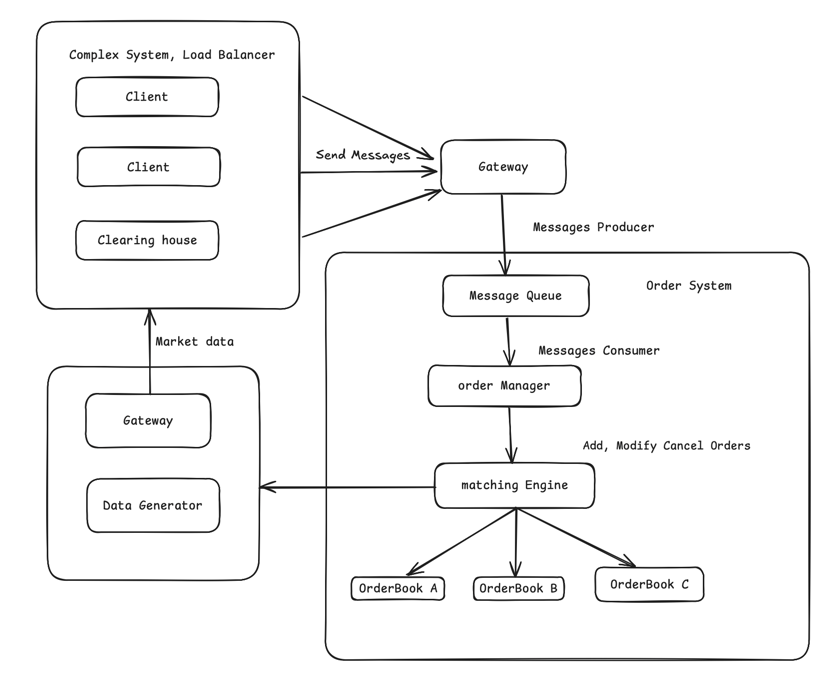

# Matching Engine Project

This project implements an order-matching engine using a doubly linked list and hash table, providing core functionality for order intake/processing, order book management, and trade record generation.

## Module Responsibilities

1. **Gateway**

   * **Client Gateway**
     Listens for data I/O from external systems, parses protocols and converts formats to provide reliable interfaces for the Order Manager and Matching Engine. Supports multiple protocols (TCP, FIX) for compatibility and stability.
   * **Market Data Gateway**
     Collects processed output from the Matching Engine or Order Book and publishes execution reports (order status, fill price, fill quantity) and market data (best bid/offer or full depth Level 2 data) to front-end clients or external data consumers.

2. **MessageQueue (Order Flow Pipeline)**
   Provides an interface for the front end to submit order messages.

3. **OrderManager**

   * Receives messages from the MessageQueue
   * Performs validation and preprocessing, then invokes the appropriate Matching Engine operations

4. **MatchingEngine**

   * Accepts new orders from the OrderManager, executes matching and fills, and generates trade records.
   * Updates the last traded price in real time.
   * For partially or wholly unfilled orders, calls the OrderBook API to insert the remaining quantity.
   * Uses the Observer pattern to notify modules (e.g., stop-order trigger, market data interface) of price and market data updates.

5. **OrderBook**

   * Maintains structured storage of limit and stop orders, including price levels, linked-list order chains, and price→order-node mappings.
   * Exposes APIs for the OrderManager (add/modify/delete orders) and for the MatchingEngine (insert unfilled orders).
   * Ensures efficient order state management and reliable data support for the MatchingEngine.

6. **DataGenerator**
   Generates synthetic market data and persists each individual order record.
